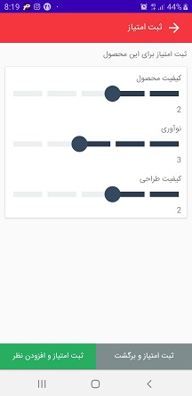
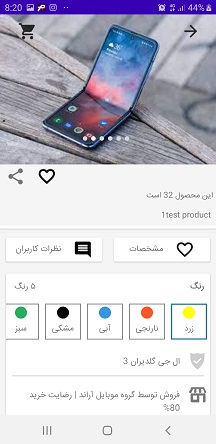
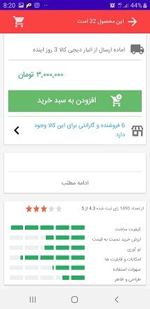
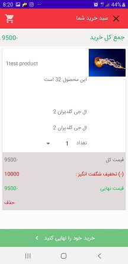

# store-app
It is a store app with features such as user panel, product slider, scoring by users, implementation api to send and receive information from the server database, timer, using material design topics such as fonts, display numbers in Persian, spancount list, custom view, as well as the ability to share, view product specifications and colors, the ability to check product inventory, implementing of shopping cart and step-by-step shopping, as well as payment through the bank portal.

     
